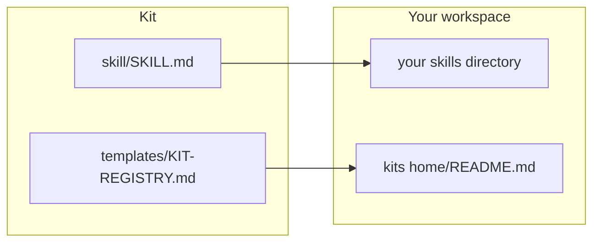

# terraform — implementation kit

> **Not that Terraform.** This has nothing to do with HashiCorp Terraform or infrastructure-as-code. The name is literal: it *terraforms someone else's environment* so a system you built can live there. If that collision would confuse your team, the installer's first decision offers you a rename (`implementation-kit`) and tells you exactly what to change.

A generator: it turns any system you've built into an **implementation kit** — a small repo that the *recipient's* AI reads, scans their stack against, and installs an adapted version from, tracking progress in a file that survives a dead chat. Takes about 20–30 minutes to install the generator itself, then another 60–120 minutes to package and cold-test one real kit. You end up with the generator installed in your workspace, a kits home with an install record, and one real kit already built, sanitized, and cold-tested to at least 8/10.

## Read this first — what this is and why

**The problem.** You built something that works — a way of running projects, a research routine, a report your team can't live without — and now three people want it. So you explain it. Then you explain it again, slightly differently, to someone whose setup is nothing like yours. Handing over your actual files doesn't work: they're full of your paths, your names, your tools, your assumptions. Writing documentation doesn't work either, because documentation describes the system and nobody has time to *install* it from a description. The knowledge stays trapped in the one person who built it.

**What this installs.** A procedure your AI runs on any build you own: it reads the whole thing, separates what makes it work *anywhere* from what only works *for you*, turns your personal choices into decisions the recipient gets to make (with your reasoning attached as the recommendation), and writes a kit whose instructions are addressed to *their* AI. Then it strips every name, path, and business detail and proves it with a search gate, and it hands the finished kit to a fresh agent that installs it for real and scores it out of 10. Under 8, you fix it and re-run.

**Use it if:** you're the bottleneck on something you built · you want to give your team AI skills that work on *their* setup, not just yours · you've handed someone a folder of your files and watched it not take · you're sharing a system with a partner or client and can't send them your internal paths · you want the thing you built to outlive your explanation of it.

**Concrete use cases:** give every employee your project-management convention, installed into whatever tool each of them actually uses · hand a partner agency your reporting routine without exposing customer data · publish a system you're proud of as a repo strangers can actually run · onboard a contractor onto your workflow in an hour with no meeting.

**It is not** documentation, a template repo, or a package manager. Templates give people files and hope; this gives their AI a script, a set of choices, and a progress file — and it's tested by someone who has never seen your work.

**→ Want the full picture before deciding?** Read [OVERVIEW.md](OVERVIEW.md) — every concept, how a packaging run flows, what gets installed, your role versus your AI's. `EXAMPLE-KIT.md` (one real build packaged start to finish) stays as a reference file — its key numbers are in the table below, so you don't have to read it to decide.

## How to use it — three on-ramps

1. **You have a coding agent** (Claude Code, Cursor, Codex, Copilot Workspace, Amp…): open this repo with it and say **"Read IMPLEMENT.md and walk me through it."** It scans your stack, presents six decisions, installs the procedure, and then packages one of your real builds with you, cold test included.
2. **You have a chat-only AI:** paste `IMPLEMENT.md` into the chat, follow along, create the files yourself, and keep `STATUS.md` as a note you paste back each session. The sanitize search becomes find-in-files in your editor; the cold test becomes a second chat window with no context. The procedure is unchanged.
3. **No AI at all:** read `IMPLEMENT.md` yourself — every step is doable by hand, and a kit is just markdown files.

**What you'll need:** nothing mandatory — `git`/`gh`, a shell, and a subagent-capable platform each make one step (distribution, the sanitize gate, the cold test) push-button; without them, each falls back to a manual equivalent that works the same way.

**Model recommendation:** run the install, and every kit's extraction step, on your most capable model at high reasoning effort — weaker models cut too much and leave a correct but unusable abstraction. The mechanical parts (search gate, publish commands) are fine on anything.

## Where it lands

| What lands | Default destination | Decided by |
|---|---|---|
| `skill/SKILL.md` + `skill/references/` | your skills directory, or `<workspace>/_tools/` if you don't have one | DP-1 |
| `templates/KIT-REGISTRY.md`, installed as the kits home's `README.md` | your kits home, e.g. `<workspace>/kits/` | DP-2 |
| one line, not a file | your standing instructions file (`CLAUDE.md` / `AGENTS.md` / rules file) | Phase 2 step 4 |
| `.sanitize-terms` / `.sanitize-terms.cs` (created during install) | `<kits home>/` | DP-5 |
| each finished kit (built during Phase 3) | `<kits home>/<kit-name>/` — private repo, public repo, or a plain folder | DP-2, DP-3 |

No new root folder unless you don't already have one; your AI confirms each destination with you before writing.

## What's in here

| Path | What it is |
|---|---|
| `OVERVIEW.md` | The full explanation — read this first to understand the system before installing |
| `EXAMPLE-KIT.md` | The worked example, start to finish: 4,027 words for a small kit (up to ~8,400 with a full procedure as payload), 5 decision points, scored 8.5/10 on its own cold test |
| `IMPLEMENT.md` | The installer script, written to your AI (humans can follow it too) |
| `STATUS.md` | Install progress — scan results, decisions, phase ticks; the resume spine |
| `AGENTS.md` / `CLAUDE.md` | Entry instructions for coding agents that auto-read those files |
| `skill/SKILL.md` | The procedure itself, in portable agent-skill format |
| `skill/references/kit-skeleton.md` | The kit file set, the installer's phase structure, the decision-block format, the degradation tiers, and every authoring rule a cold test has taught so far |
| `skill/references/sanitize-checklist.md` | Building the term list, the strip-and-genericize pass, the search gate, the report |
| `skill/references/lessons.md` | Seeded with what the first three kits taught; you append to it |
| `templates/KIT-REGISTRY.md` | The kits index the installer creates for you, with an install record of your choices |
| `templates/kit-scaffold/` | Stub files the generator stamps out at the start of each kit — see `templates/README.md` for what maps to which decision |
